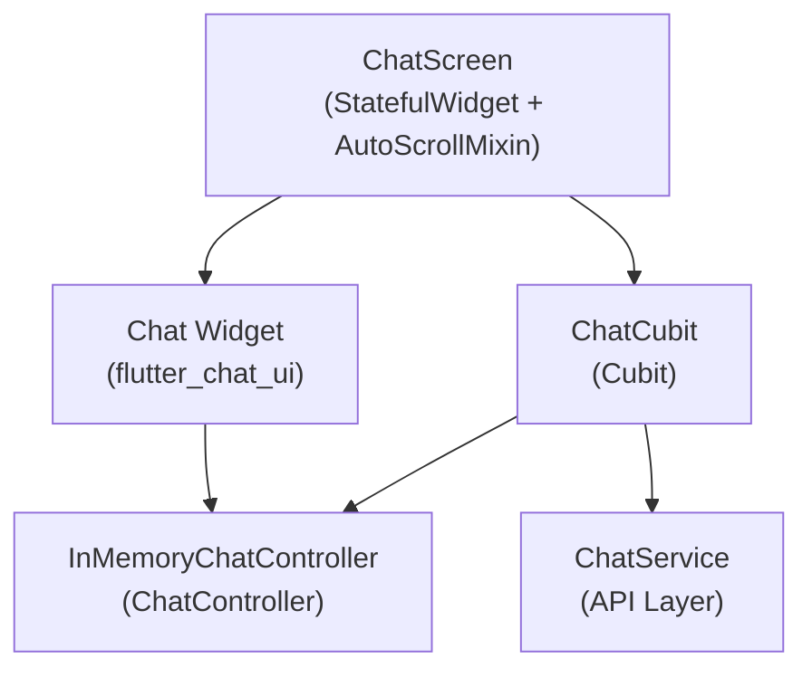

# Chat Architecture Guide — flutter_chat_ui + Cubit (Full Response, No Streaming)

> This guide covers the case where your API returns a **complete response** (not chunks).  
> Streaming-specific components (`StreamManager`, `TextStreamMessage`) are not needed.

---

## 1. Component Map



---

## 2. What You Need (and What You Don't)

| Component | Needed? | Notes |
|-----------|---------|-------|
| `InMemoryChatController` | ✅ | Holds messages, drives Chat widget |
| `AutoScrollMixin` | ✅ | Handles scroll-to-bottom logic |
| `Chat` widget | ✅ | Displays messages + composer |
| `ChatComposer` | ✅ | Text input + attachment button |
| `ChatCubit` | ✅ | Replaces ChangeNotifier ViewModel |
| `StreamManager` | ❌ | Only needed for streaming |
| `TextStreamMessage` | ❌ | Only needed for streaming |
| `StreamState` | ❌ | Only needed for streaming |

---

## 3. Dependencies

```yaml
# pubspec.yaml
dependencies:
  flutter_chat_ui: ^2.11.1          # Chat UI
  flutter_chat_core: any            # Message types, ChatController
  flyer_chat_text_message: any      # Text message widget
  flyer_chat_image_message: any     # Image message widget (if needed)
  flutter_bloc: any                 # Cubit
  equatable: any                    # ChatState equality
  cross_cache: any                  # Image caching
  uuid: any                         # Message IDs
  image_picker: any                 # Attachment (if needed)
```

---

## 4. Layer 1 — Data: InMemoryChatController

This is the **single source of truth** for messages.  
The `Chat` widget observes it via `operationsStream` and animates changes automatically.

```dart
// lib/features/chat/data/in_memory_chat_controller.dart

import 'dart:async';
import 'package:flutter_chat_core/flutter_chat_core.dart';

class InMemoryChatController
    with UploadProgressMixin, ScrollToMessageMixin
    implements ChatController {

  final _ops = StreamController<ChatOperation>.broadcast();
  final List<Message> _messages = [];

  @override
  List<Message> get messages => List.unmodifiable(_messages);

  @override
  Stream<ChatOperation> get operationsStream => _ops.stream;

  @override
  Future<void> insertMessage(Message message, {int? index, bool animated = true}) async {
    if (_messages.any((m) => m.id == message.id)) return;
    _messages.add(message);
    _messages.sort((a, b) =>
        (a.createdAt?.millisecondsSinceEpoch ?? 0)
            .compareTo(b.createdAt?.millisecondsSinceEpoch ?? 0));
    final i = _messages.indexOf(message);
    _ops.add(ChatOperation.insert(message, i, animated: animated));
  }

  @override
  Future<void> removeMessage(Message message, {bool animated = true}) async {
    final i = _messages.indexWhere((m) => m.id == message.id);
    if (i != -1) {
      final removed = _messages.removeAt(i);
      _ops.add(ChatOperation.remove(removed, i, animated: animated));
    }
  }

  @override
  Future<void> updateMessage(Message oldMessage, Message newMessage) async {
    final i = _messages.indexWhere((m) => m.id == oldMessage.id);
    if (i != -1) {
      if (_messages[i] == newMessage) return;
      final actual = _messages[i];
      _messages[i] = newMessage;
      _ops.add(ChatOperation.update(actual, newMessage, i));
    }
  }

  @override
  Future<void> setMessages(List<Message> messages, {bool animated = true}) async {
    _messages.clear();
    _messages.addAll(messages);
    _ops.add(ChatOperation.set(messages, animated: animated));
  }

  @override
  Future<void> insertAllMessages(List<Message> messages, {int? index, bool animated = true}) async {
    if (messages.isEmpty) return;
    final originalLength = _messages.length;
    _messages.addAll(messages);
    _messages.sort((a, b) =>
        (a.createdAt?.millisecondsSinceEpoch ?? 0)
            .compareTo(b.createdAt?.millisecondsSinceEpoch ?? 0));
    _ops.add(ChatOperation.insertAll(messages, originalLength, animated: animated));
  }

  @override
  void dispose() {
    _ops.close();
    disposeUploadProgress();
    disposeScrollMethods();
  }
}
```

---

## 5. Layer 2 — State: ChatCubit

### State class

```dart
// lib/features/chat/presentation/chat_state.dart

import 'package:equatable/equatable.dart';

class ChatState extends Equatable {
  final bool isLoading; // true while waiting for API response
  final bool isEmpty;   // true when no messages yet

  const ChatState({
    this.isLoading = false,
    this.isEmpty = true,
  });

  ChatState copyWith({bool? isLoading, bool? isEmpty}) => ChatState(
    isLoading: isLoading ?? this.isLoading,
    isEmpty: isEmpty ?? this.isEmpty,
  );

  @override
  List<Object?> get props => [isLoading, isEmpty];
}
```

### Cubit

```dart
// lib/features/chat/presentation/chat_cubit.dart

import 'dart:async';
import 'package:cross_cache/cross_cache.dart';
import 'package:flutter/foundation.dart';
import 'package:flutter_bloc/flutter_bloc.dart';
import 'package:flutter_chat_core/flutter_chat_core.dart';
import 'package:image_picker/image_picker.dart';
import 'package:uuid/uuid.dart';

import '../data/chat_service.dart';
import '../data/in_memory_chat_controller.dart';
import 'chat_state.dart';

class ChatCubit extends Cubit<ChatState> {
  ChatCubit({required String apiKey})
      : _service = ChatService(apiKey: apiKey),
        super(const ChatState());

  final ChatService _service;
  final _uuid = const Uuid();

  final InMemoryChatController chatController = InMemoryChatController();
  final CrossCache crossCache = CrossCache();

  final User currentUser = const User(id: 'me');
  final User agent = const User(id: 'agent');

  // Wired by the Screen so the mixin can trigger scroll
  VoidCallback? onMessageInserted;

  Future<User?> resolveUser(String id) => Future.value(switch (id) {
    'me'    => currentUser,
    'agent' => agent,
    _       => null,
  });

  // ── Send text ──────────────────────────────────────────────

  Future<void> sendTextMessage(String text) async {
    final normalized = text.trim();
    if (normalized.isEmpty) return;

    // 1. Insert user message immediately
    await chatController.insertMessage(TextMessage(
      id: _uuid.v4(),
      authorId: currentUser.id,
      createdAt: DateTime.now().toUtc(),
      text: normalized,
    ));
    emit(state.copyWith(isEmpty: false, isLoading: true));
    onMessageInserted?.call(); // scroll to show user message

    try {
      // 2. Await full response
      final responseText = await _service.sendMessage(normalized);

      // 3. Insert assistant message
      await chatController.insertMessage(TextMessage(
        id: _uuid.v4(),
        authorId: agent.id,
        createdAt: DateTime.now().toUtc(),
        text: responseText,
      ));
      onMessageInserted?.call(); // scroll to show assistant message
    } catch (e) {
      debugPrint('ChatCubit: error — $e');
      await chatController.insertMessage(TextMessage(
        id: _uuid.v4(),
        authorId: agent.id,
        createdAt: DateTime.now().toUtc(),
        text: 'Something went wrong. Please try again.',
      ));
      onMessageInserted?.call();
    } finally {
      emit(state.copyWith(isLoading: false));
    }
  }

  // ── Send image ─────────────────────────────────────────────

  Future<void> sendImageFromGallery() async {
    final image = await ImagePicker().pickImage(source: ImageSource.gallery);
    if (image == null) return;

    await crossCache.downloadAndSave(image.path);
    await chatController.insertMessage(ImageMessage(
      id: _uuid.v4(),
      authorId: currentUser.id,
      createdAt: DateTime.now().toUtc(),
      source: image.path,
    ));
    emit(state.copyWith(isEmpty: false, isLoading: true));
    onMessageInserted?.call();

    try {
      final bytes = await crossCache.get(image.path);
      final responseText = await _service.sendImage(bytes);
      await chatController.insertMessage(TextMessage(
        id: _uuid.v4(),
        authorId: agent.id,
        createdAt: DateTime.now().toUtc(),
        text: responseText,
      ));
      onMessageInserted?.call();
    } catch (e) {
      debugPrint('ChatCubit: image error — $e');
    } finally {
      emit(state.copyWith(isLoading: false));
    }
  }

  @override
  Future<void> close() {
    chatController.dispose();
    crossCache.dispose();
    return super.close();
  }
}
```

---

## 6. Layer 3 — Scroll: AutoScrollMixin

Attach this mixin to your Screen's State. It handles all scroll-to-bottom logic.

```dart
// lib/features/chat/utils/auto_scroll_mixin.dart

import 'dart:async';
import 'package:flutter/rendering.dart';
import 'package:flutter/widgets.dart';

mixin AutoScrollMixin<T extends StatefulWidget> on State<T> {
  final ScrollController scrollController = ScrollController();

  bool _autoScroll = true;
  bool _scheduled = false;
  bool _smoothing = false;
  bool _scrolledAway = false;

  bool get isUserScrolledAway => _scrolledAway;

  @protected
  void disposeAutoScroll() => scrollController.dispose();

  /// Call this whenever a new message is inserted (user or assistant).
  void onIncomingContent() => scheduleScrollToBottom();

  /// Call when the user sends a message to re-enable auto-scroll.
  void enableAutoScroll() {
    _autoScroll = true;
    _setScrolledAway(false);
  }

  /// Pass this to NotificationListener wrapping ChatAnimatedList.
  bool handleScrollNotification(ScrollNotification n) {
    final atBot = _isNearBottom(n.metrics);
    if (n is UserScrollNotification) {
      if (n.direction == ScrollDirection.idle) {
        if (atBot) { _autoScroll = true; _setScrolledAway(false); }
      } else {
        _autoScroll = atBot;
        _setScrolledAway(!atBot);
      }
      return false;
    }
    if (n is ScrollUpdateNotification) {
      if (n.dragDetails != null) { _autoScroll = atBot; _setScrolledAway(!atBot); }
      if (atBot) { _autoScroll = true; _setScrolledAway(false); }
    }
    if (n is ScrollEndNotification && atBot) {
      _autoScroll = true;
      _setScrolledAway(false);
    }
    return false;
  }

  /// Called when the user taps the scroll-to-bottom FAB.
  void jumpToBottom() {
    if (!scrollController.hasClients) return;
    _autoScroll = true;
    _setScrolledAway(false);
    unawaited(_doScroll(smooth: true));
  }

  void scheduleScrollToBottom({bool smooth = false}) {
    if (!_autoScroll || _scheduled) return;
    if (smooth && _smoothing) return;
    _scheduled = true;
    WidgetsBinding.instance.addPostFrameCallback((_) {
      _scheduled = false;
      if (!smooth && _smoothing) return;
      unawaited(_doScroll(smooth: smooth));
    });
  }

  void _setScrolledAway(bool v) {
    if (_scrolledAway == v) return;
    _scrolledAway = v;
    if (mounted) setState(() {});
  }

  bool _isNearBottom(ScrollMetrics m) {
    final bottom = m.axisDirection == AxisDirection.down
        ? m.maxScrollExtent
        : m.minScrollExtent;
    return (m.pixels - bottom).abs() <= 20.0;
  }

  Future<void> _doScroll({bool smooth = false}) async {
    if (!_autoScroll || !scrollController.hasClients) return;
    final p = scrollController.position;
    final target = (p.axisDirection == AxisDirection.down
            ? p.maxScrollExtent
            : p.minScrollExtent)
        .clamp(p.minScrollExtent, p.maxScrollExtent);
    final dist = (p.pixels - target).abs();
    if (dist <= 0.5) return;
    if (smooth) {
      if (_smoothing) return;
      _smoothing = true;
      try {
        final ms = (dist / 1.2).round().clamp(260, 2200);
        await scrollController.animateTo(
          target,
          duration: Duration(milliseconds: ms),
          curve: Curves.easeOutCubic,
        );
      } finally { _smoothing = false; }
      return;
    }
    scrollController.jumpTo(target);
  }
}
```

---

## 7. Layer 4 — Presentation: Screen

```dart
// lib/features/chat/presentation/chat_screen.dart

import 'dart:async';
import 'package:flutter/material.dart';
import 'package:flutter_bloc/flutter_bloc.dart';
import '../utils/auto_scroll_mixin.dart';
import 'chat_cubit.dart';
import 'chat_state.dart';
import 'widgets/chat_app_bar.dart';
import 'widgets/chat_body.dart';

class ChatScreen extends StatefulWidget {
  const ChatScreen({super.key, required this.apiKey});
  final String apiKey;

  @override
  State<ChatScreen> createState() => _ChatScreenState();
}

class _ChatScreenState extends State<ChatScreen> with AutoScrollMixin {
  late final ChatCubit _cubit;

  @override
  void initState() {
    super.initState();
    _cubit = ChatCubit(apiKey: widget.apiKey);
    // Wire scroll callback — same as before, just renamed
    _cubit.onMessageInserted = onIncomingContent;
  }

  @override
  void dispose() {
    _cubit.close();
    disposeAutoScroll();
    super.dispose();
  }

  void _handleSend(String text) {
    enableAutoScroll();
    scheduleScrollToBottom(smooth: true);
    unawaited(_cubit.sendTextMessage(text));
  }

  void _handleAttachment() {
    enableAutoScroll();
    scheduleScrollToBottom(smooth: true);
    unawaited(_cubit.sendImageFromGallery());
  }

  @override
  Widget build(BuildContext context) {
    return BlocProvider.value(
      value: _cubit,
      child: BlocBuilder<ChatCubit, ChatState>(
        builder: (context, state) {
          return Scaffold(
            appBar: ChatAppBar(isLoading: state.isLoading),
            body: ChatBody(
              cubit: _cubit,
              isLoading: state.isLoading,
              isEmpty: state.isEmpty,
              scrollController: scrollController,
              isUserScrolledAway: isUserScrolledAway,
              onScrollNotification: handleScrollNotification,
              onMessageSend: _handleSend,
              onAttachmentTap: _handleAttachment,
              onJumpToBottom: jumpToBottom,
            ),
          );
        },
      ),
    );
  }
}
```

---

## 8. Layer 5 — Presentation: ChatBody

```dart
// lib/features/chat/presentation/widgets/chat_body.dart

import 'package:flutter/material.dart';
import 'package:flutter_chat_core/flutter_chat_core.dart';
import 'package:flutter_chat_ui/flutter_chat_ui.dart';
import 'package:flyer_chat_image_message/flyer_chat_image_message.dart';
import 'package:flyer_chat_text_message/flyer_chat_text_message.dart';
import '../chat_cubit.dart';
import 'chat_composer.dart';
import 'chat_empty_state.dart';
import 'scroll_to_bottom_fab.dart';

class ChatBody extends StatelessWidget {
  const ChatBody({
    super.key,
    required this.cubit,
    required this.isLoading,
    required this.isEmpty,
    required this.scrollController,
    required this.isUserScrolledAway,
    required this.onScrollNotification,
    required this.onMessageSend,
    required this.onAttachmentTap,
    required this.onJumpToBottom,
  });

  final ChatCubit cubit;
  final bool isLoading, isEmpty, isUserScrolledAway;
  final ScrollController scrollController;
  final bool Function(ScrollNotification) onScrollNotification;
  final ValueChanged<String> onMessageSend;
  final VoidCallback onAttachmentTap, onJumpToBottom;

  @override
  Widget build(BuildContext context) {
    final theme = Theme.of(context);
    return Stack(children: [
      // Background gradient
      _gradient(theme),

      // Chat widget — always rendered so provider callbacks work
      Chat(
        builders: Builders(
          chatAnimatedListBuilder: (ctx, itemBuilder) =>
              NotificationListener<ScrollNotification>(
            onNotification: onScrollNotification,
            child: ChatAnimatedList(
              scrollController: scrollController,
              itemBuilder: itemBuilder,
            ),
          ),
          textMessageBuilder: _buildTextMessage,
          imageMessageBuilder: _buildImageMessage,
          composerBuilder: (ctx) => ChatComposer(
            isLoading: isLoading,
          ),
          // Hide built-in empty state and scroll button (we use our own)
          emptyChatListBuilder: (ctx) => const SizedBox.shrink(),
          scrollToBottomBuilder: (ctx, anim, onPressed) => const SizedBox.shrink(),
        ),
        chatController: cubit.chatController,
        crossCache: cubit.crossCache,
        currentUserId: cubit.currentUser.id,
        onAttachmentTap: onAttachmentTap,
        onMessageSend: onMessageSend,
        resolveUser: cubit.resolveUser,
        theme: ChatTheme.fromThemeData(theme),
      ),

      // Custom empty state overlay
      if (isEmpty) const ChatEmptyState(),

      // Custom scroll-to-bottom FAB
      ScrollToBottomFab(
        isVisible: isUserScrolledAway,
        onPressed: onJumpToBottom,
      ),
    ]);
  }

  Widget _buildTextMessage(
    BuildContext context, TextMessage message, int index, {
    required bool isSentByMe, MessageGroupStatus? groupStatus,
  }) {
    return FlyerChatTextMessage(
      message: message, index: index,
      showTime: false, showStatus: false,
      receivedBackgroundColor: Colors.transparent,
      padding: message.authorId == cubit.agent.id
          ? EdgeInsets.zero
          : const EdgeInsets.symmetric(horizontal: 16, vertical: 10),
    );
  }

  Widget _buildImageMessage(
    BuildContext context, ImageMessage message, int index, {
    required bool isSentByMe, MessageGroupStatus? groupStatus,
  }) {
    return FlyerChatImageMessage(
      message: message, index: index,
      showTime: false, showStatus: false,
    );
  }

  Widget _gradient(ThemeData theme) => Positioned.fill(
    child: DecoratedBox(
      decoration: BoxDecoration(
        gradient: LinearGradient(
          begin: Alignment.topCenter,
          end: Alignment.bottomCenter,
          colors: [
            theme.colorScheme.surface,
            theme.colorScheme.surfaceContainerLow.withValues(alpha: 0.5),
          ],
        ),
      ),
    ),
  );
}
```

---

## 9. Full Data Flow

```
1.  User types a message
2.  Composer → OnMessageSendCallback → _handleSend()
3.  enableAutoScroll() + scheduleScrollToBottom()
4.  cubit.sendTextMessage(text)
5.  chatController.insertMessage(userTextMessage)  ← appears in UI + animates
6.  emit(isLoading: true, isEmpty: false)          ← AppBar shows loading indicator
7.  onMessageInserted() → scrolls to user message
8.  await _service.sendMessage(text)               ← waits for full response
9.  chatController.insertMessage(agentTextMessage) ← appears in UI + animates
10. onMessageInserted() → scrolls to agent message
11. emit(isLoading: false)                         ← AppBar hides indicator
```

---

## 10. Quick-Reference Cheat Sheet

```
State manager    →  ChatCubit + ChatState (Cubit replaces ChangeNotifier)
Message storage  →  InMemoryChatController (unchanged from any project)
Scroll logic     →  AutoScrollMixin (unchanged from any project)
Chat display     →  Chat widget from flutter_chat_ui (unchanged)
Loading signal   →  isLoading flag in ChatState (replaces isStreaming)
Scroll trigger   →  cubit.onMessageInserted = onIncomingContent (in initState)
```

> **No `StreamManager`. No `TextStreamMessage`. No `StreamState`.**  
> Insert messages directly as `TextMessage` and let `InMemoryChatController` handle everything else.
